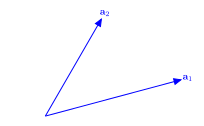
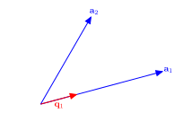
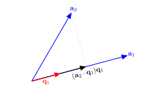
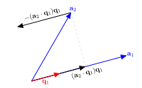
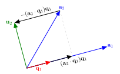
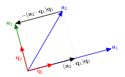
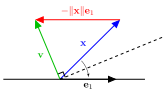
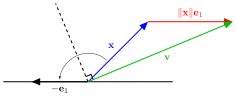

## QR Decomposition

**QR decomposition** is another decomposition method that factorises a matrix in the product of two matrices $Q$ and $R$ such that

$$ \begin{align*}
    A = QR,
\end{align*} $$

where $Q$ is an orthogonal matrix and $R$ is an upper triangular matrix.

::: {.callout-note}
A set of vectors $\lbrace \mathbf{v}_1 ,\mathbf{v}_2 ,\mathbf{v}_3 ,\dots \rbrace$ is said to be **orthogonal** if $\mathbf{v}_i \cdot \mathbf{v}_j =0$ for $i\not= j$. Furthermore the set is said to be **orthonormal** if $\mathbf{v}_i$ are all unit vectors.
:::

::: {.callout-note}
An **orthogonal matrix** is a matrix where the columns are a set of orthonormal vectors. If $A$ is an orthogonal matrix if

$$ \begin{align*}
    A^\mathsf{T} A=I.
\end{align*} $$
:::

---

Consider the matrix

$$ \begin{align*}
    A= \begin{pmatrix}
        0.8 & -0.6\\
        0.6 & 0.8
    \end{pmatrix}.
\end{align*} $$

This is an orthogonal matrix since

$$ \begin{align*}
    A^\mathsf{T} A=\begin{pmatrix}
        0.8 & 0.6\\
        -0.6 & 0.8
    \end{pmatrix}
    \begin{pmatrix}
        0.8 & -0.6\\
        0.6 & 0.8
    \end{pmatrix} = 
    \begin{pmatrix}
        1 & 0\\
        0 & 1
    \end{pmatrix}=I.
\end{align*} $$

Furthermore it is an orthonormal matrix since the magnitude of the columns for $A$ are both 1.

## QR decomposition using the Gram-Schmidt process

Consider the $3 \times 3$ matrix $A$ represented as the concatenation of the column vectors $\mathbf{a}_1, \mathbf{a}_2, \mathbf{a}_3$

$$ \begin{pmatrix}
    a_{11} & a_{12} & a_{13} \\
    a_{21} & a_{22} & a_{23} \\
    a_{31} & a_{32} & a_{33}
\end{pmatrix} =
\begin{pmatrix}
    \uparrow & \uparrow & \uparrow \\
    \mathbf{a}_1 & \mathbf{a}_2 & \mathbf{a}_3 \\
    \downarrow & \downarrow & \downarrow
\end{pmatrix} $$

To calculate the orthogonal $Q$ matrix we need a set of vectors $\{\mathbf{q}_1, \mathbf{q}_2, \mathbf{q}_3\}$ that span the same space as $\{\mathbf{a}_1, \mathbf{a}_2, \mathbf{a}_3\}$ but are orthogonal to each other. One way to do this is using the **Gram-Schmidt process**.

## The Gram-Schmidt Process {auto-animate="true"}

<p align="center">
  
</p>

Consider this diagram that shows the first two non-orthogonal vectors $\mathbf{a}_1$ and $\mathbf{a}_2$. 

## The Gram-Schmidt Process {auto-animate="true"}

<p align="center">
  
</p>

$\mathbf{q}_1$ is the unit vector that is parallel to $\mathbf{a}_1$

## The Gram-Schmidt Process {auto-animate="true"}

<p align="center">
  
</p>

$(\mathbf{a}_2 \cdot \mathbf{q}_1) \mathbf{q}_1$ is the vector projection of $\mathbf{a}_2$ onto $\mathbf{a}_1$.

## The Gram-Schmidt Process {auto-animate="true"}

<p align="center">
  
</p>

Subracting this projection from $\mathbf{a}_2$ gives the orthogonal vector $\mathbf{u}_2$. 

## The Gram-Schmidt Process {auto-animate="true"}

<p align="center">
  
</p>

Subracting this projection from $\mathbf{a}_2$ gives the orthogonal vector $\mathbf{u}_2$.

## The Gram-Schmidt Process {auto-animate="true"}

<p align="center">
  
</p>

Normalising $\mathbf{u}_2$ gives the unit orthogonal vector $\mathbf{q}_2$.

## QR decomposition using the Gram-Schmidt process

Subtract the vector projection of $\mathbf{a}_2$ onto $\mathbf{u}_1$

$$ \mathbf{u}_2 = \mathbf{a}_2 - \left( \frac{\mathbf{q}_1 \cdot \mathbf{a}_1}{\mathbf{q}_1 \cdot \mathbf{u}_1} \right) \mathbf{u}_1.$$

Normalise $\mathbf{u}_1$ such that $\mathbf{q}_1 = \dfrac{\mathbf{u}_1}{\|\mathbf{u}_1\|}$ so we have

$$ \mathbf{u}_2 = \mathbf{a}_2 - (\mathbf{q}_1 \cdot \mathbf{a}_2) \mathbf{q}_1. $$

Normalise $\mathbf{u}_2$ to give $\mathbf{q}_2 = \dfrac{\mathbf{u}_2}{\|\mathbf{u}_2\|}$. 

Subtract the vector projections of $\mathbf{a}_3$ onto $\mathbf{q}_1$ and $\mathbf{q}_2$ from $\mathbf{a}_3$

$$ \mathbf{u}_3 = \mathbf{a}_3 - (\mathbf{q}_1 \cdot \mathbf{a}_3) \mathbf{q}_1 - (\mathbf{q}_2 \cdot \mathbf{a}_3) \mathbf{q}_2. $$

Normalise $\mathbf{u}_3$ to give $\mathbf{q}_3 = \dfrac{\mathbf{u}_3}{\|\mathbf{u}_3\|}$.

---

Since $\mathbf{u}_i = (\mathbf{q}_i \cdot \mathbf{a}_i) \mathbf{q}_i$ and rearranging the equations for $\mathbf{u}_i$ to make $\mathbf{a}_i$ the subject gives

$$ \begin{align*}
  \mathbf{a}_1 &= (\mathbf{q}_1 \cdot \mathbf{a}_1), \\
  \mathbf{a}_2 &= (\mathbf{q}_1 \cdot \mathbf{a}_2) \mathbf{q}_1 + (\mathbf{q}_2 \cdot \mathbf{a}_2) \mathbf{q}_2, \\
  \mathbf{a}_3 &= (\mathbf{q}_1 \cdot \mathbf{a}_3) \mathbf{q}_1 + (\mathbf{q}_2 \cdot \mathbf{a}_3) \mathbf{q}_2 + (\mathbf{q}_3 \cdot \mathbf{a}_3) \mathbf{q}_3, \\
  & \vdots 
\end{align*} $$

The columns of the $Q$ matrix are formed using the vectors $\mathbf{q}_i$ 

$$ Q = 
\begin{pmatrix}
    \uparrow & \uparrow & & \uparrow \\
    \mathbf{q}_1 & \mathbf{q}_2 & \cdots & \mathbf{q}_n \\
    \downarrow & \downarrow & & \downarrow
\end{pmatrix}, $$

and the elements of the $R$ matrix are formed from the dot products of the $\mathbf{q}_i$ and $\mathbf{a}_j$ vectors such that

$$ R = \begin{pmatrix}
  (\mathbf{q}_1 \cdot \mathbf{a}_1) & (\mathbf{q}_1 \cdot \mathbf{a}_2) & \cdots & (\mathbf{q}_1 \cdot \mathbf{a}_n) \\
  0 & (\mathbf{q}_2 \cdot \mathbf{a}_2) & \cdots & (\mathbf{q}_1 \cdot \mathbf{a}_n) \\
  \vdots & \ddots & \ddots & \vdots \\
  0 & \cdots & 0 & (\mathbf{q}_n \cdot \mathbf{a}_n)
\end{pmatrix}. $$

## QR Gram-Schmidt Algorithm

::: {.callout-note}
- For $j = 1, \ldots, n$ do
  - For $i = 1, \ldots, j - 1$ do
    - $r_{ij} \gets \mathbf{q}_i \cdot \mathbf{a}_j$ 
  - $\mathbf{u}_j \gets \mathbf{a}_j - \displaystyle\sum_{i=1}^{j-1} r_{ij} \mathbf{q}_j$
  - $r_{jj} \gets \| \mathbf{u}_j \|$
  - $\mathbf{q}_j \gets \dfrac{\mathbf{u}_j}{r_{jj}}$
- $Q \gets (\mathbf{q}_1, \mathbf{q}_2, \ldots, \mathbf{q}_2)$

- For $i = 1, \ldots, n$ do
  - If $r_{ii} < 0$ then
    - $R(i,: ) \gets -R(i,:)$
    - $Q(:,i) \gets -Q(:,i)$
:::

## QR Gram-Schmidt Example

Calculate the QR decomposition of the following matrix using the Gram-Schmidt process

$$ \begin{align*}
    A  = \begin{pmatrix}
        -1 & -1 & 1 \\
        1 & 3 & 3 \\
        -1 & -1 & 5 \\
        1 & 3 & 7
    \end{pmatrix}.
\end{align*} $$

:::{.fragment}

**Solution:**

$$ \begin{align*}
  j &= 1: & \mathbf{u}_1 &= \mathbf{a}_1 = \begin{pmatrix} -1 \\ 1 \\ -1 \\ 1 \end{pmatrix}, \\
  && r_{11} &= \| \mathbf{u}_1 \| = 2, \\
  && \mathbf{q}_1 &= \frac{\mathbf{u}_1}{r_{11}} = \frac{1}{2} \begin{pmatrix} -1 \\ 1 \\ 1 \\ 1 \end{pmatrix} = \begin{pmatrix} -\frac{1}{2} \\ \frac{1}{2} \\ -\frac{1}{2} \\ \frac{1}{2} \end{pmatrix}, \\
\end{align*} $$
:::

---

$$ \begin{align*}
  j &= 2: & r_{12} &= \mathbf{q}_1 \cdot \mathbf{a}_2 = 
  \begin{pmatrix} -\frac{1}{2} \\ \frac{1}{2} \\ -\frac{1}{2} \\ \frac{1}{2} \end{pmatrix} \cdot \begin{pmatrix} -1 \\ 3 \\ -1 \\ 3 \end{pmatrix} = 4, \\
  && \mathbf{u}_2 &= \mathbf{a}_2 - r_{12} \mathbf{q}_1 = 
  \begin{pmatrix} -1 \\ 3 \\ -1 \\ 3 \end{pmatrix} - 4 
  \begin{pmatrix} -\frac{1}{2} \\ \frac{1}{2} \\ -\frac{1}{2} \\ \frac{1}{2} \end{pmatrix} = 
  \begin{pmatrix} 1 \\ 1 \\ 1 \\ 1 \end{pmatrix}, \\
  && r_{22} &= \| \mathbf{u}_2 \| = 2, \\
  && \mathbf{q}_2 &= \frac{\mathbf{u}_2}{r_{22}} = \frac{1}{2}
  \begin{pmatrix} 1 \\ 1 \\ 1 \\ 1 \end{pmatrix} = 
  \begin{pmatrix} \frac{1}{2} \\ \frac{1}{2} \\ \frac{1}{2} \\ \frac{1}{2} \end{pmatrix}.
\end{align*} $$

---

$$ \begin{align*}
  j &= 2: & r_{12} &= \mathbf{q}_1 \cdot \mathbf{a}_2 = 
  \begin{pmatrix} -\frac{1}{2} \\ \frac{1}{2} \\ -\frac{1}{2} \\ \frac{1}{2} \end{pmatrix} \cdot \begin{pmatrix} -1 \\ 3 \\ -1 \\ 3 \end{pmatrix} = 4, \\
  && \mathbf{u}_2 &= \mathbf{a}_2 - r_{12} \mathbf{q}_1 = 
  \begin{pmatrix} -1 \\ 3 \\ -1 \\ 3 \end{pmatrix} - 4 
  \begin{pmatrix} -\frac{1}{2} \\ \frac{1}{2} \\ -\frac{1}{2} \\ \frac{1}{2} \end{pmatrix} = 
  \begin{pmatrix} 1 \\ 1 \\ 1 \\ 1 \end{pmatrix}, \\
  && r_{22} &= \| \mathbf{u}_2 \| = 2, \\
  && \mathbf{q}_2 &= \frac{\mathbf{u}_2}{r_{22}} = \frac{1}{2}
  \begin{pmatrix} 1 \\ 1 \\ 1 \\ 1 \end{pmatrix} = 
  \begin{pmatrix} \frac{1}{2} \\ \frac{1}{2} \\ \frac{1}{2} \\ \frac{1}{2} \end{pmatrix}.
\end{align*} $$

---

The diagonal elements of $R$ are all positive so we don't need to make any adjustments. Thus the $Q$ and $R$ matrices are given by

$$ \begin{align*}
  Q &= \begin{pmatrix}
    -\frac{1}{2} & \frac{1}{2} & -\frac{1}{2} \\
    \frac{1}{2} & \frac{1}{2} & -\frac{1}{2} \\
    -\frac{1}{2} & \frac{1}{2} & \frac{1}{2} \\
    \frac{1}{2} & \frac{1}{2} & \frac{1}{2}
  \end{pmatrix}, &
  R &= 
  \begin{pmatrix}
    2 & 4 & 2 \\
    0 & 2 & 8 \\
    0 & 0 & 4
  \end{pmatrix}.
\end{align*} $$

:::{.fragment}
We can check that this is correct by verifying that $A = QR$ and that $Q^\mathsf{T}Q = I$.

$$ \begin{align*}
  \begin{pmatrix}
    -\frac{1}{2} & \frac{1}{2} & -\frac{1}{2} \\
    \frac{1}{2} & \frac{1}{2} & -\frac{1}{2} \\
    -\frac{1}{2} & \frac{1}{2} & \frac{1}{2} \\
    \frac{1}{2} & \frac{1}{2} & \frac{1}{2}
  \end{pmatrix}
  \begin{pmatrix}
    2 & 4 & 2 \\
    0 & 2 & 8 \\
    0 & 0 & 4
  \end{pmatrix} &=
  \begin{pmatrix}
    -1 & -1 & 1 \\
    1 & 3 & 3 \\
    -1 & -1 & 5 \\
    1 & 3 & 7
  \end{pmatrix} = A, \\
  \begin{pmatrix}
    -\frac{1}{2} & \frac{1}{2} & -\frac{1}{2} & \frac{1}{2} \\
    \frac{1}{2} & \frac{1}{2} & \frac{1}{2} & \frac{1}{2} \\
    -\frac{1}{2} & -\frac{1}{2} & \frac{1}{2} & \frac{1}{2}
  \end{pmatrix}
  \begin{pmatrix}
    -\frac{1}{2} & \frac{1}{2} & -\frac{1}{2} \\
    \frac{1}{2} & \frac{1}{2} & -\frac{1}{2} \\
    -\frac{1}{2} & \frac{1}{2} & \frac{1}{2} \\
    \frac{1}{2} & \frac{1}{2} & \frac{1}{2}
  \end{pmatrix} &=
  \begin{pmatrix}
    1 & 0 & 0 \\
    0 & 1 & 0 \\
    0 & 0 & 1
  \end{pmatrix} = I.
\end{align*} $$
:::

## Householder Reflections

A **Householder reflection** reflects a vector $\mathbf{x}$ about a hyperplane that is orthogonal to a given vector $\mathbf{v}$.

<p align="center">
  
</p>

The Householder matrix is an orthogonal reflection matrix of the form

$$ H = I - 2 \frac{\mathbf{v} \mathbf{v}^\mathsf{T}}{\mathbf{v}^\mathsf{T} \mathbf{v}}. $$

where $\mathbf{v} = \mathbf{x} - \| \mathbf{x} \| \mathbf{e}_1$.

The matrix $H$ is symmetric and orthogonal.

---

If the magnitude of $\mathbf{x}$ is close to being parallel to $\mathbf{e}_1$ then the calculation of $\mathbf{v}$ will involve the division by a number close to zero.

To overcome this we use a Householder transformation to reflect $\mathbf{x}$ so that it is parallel to $-\mathbf{e}_1$ instead of $+\mathbf{e}_1$. 

<p align="center">
  
</p>

To do this we calculate $\mathbf{v}$ by adding $\| \mathbf{x} \| \mathbf{e}_1$ to $\mathbf{x}$ when the sign of $x_1$ is negative, i.e.,

$$ \mathbf{v} = \mathbf{x} - \operatorname{sign}(x_1) \| \mathbf{x} \| \mathbf{e}_1, $$

where $\operatorname{sign}(x)$ returns $+1$ if $x \geq 0$ and $-1$ if $x < 0$. 

## QR Decomposition using Householder Reflections

To compute the QR decomposition of a matrix $A$, we reflect the first column of $A$, using Householder reflection so that it is parallel to $\mathbf{e}_1$. 

The vector $\mathbf{v}$ is given by

$$ \mathbf{v} = \mathbf{x} - \operatorname{sign}(x_1) \|\mathbf{x}\| \mathbf{e}_1, $$

where $\mathbf{x}$ is the first column of $A$ and $\mathbf{e}_1 = (1, 0, \ldots, 0)^\mathsf{T}$ is the first basis vector.

The first Householder matrix is then given by

$$ H_1 = I - 2 \frac{\mathbf{v} \mathbf{v}^\mathsf{T}}{\mathbf{v}^\mathsf{T} \mathbf{v}}. $$

Multiplying $H_1$ by $A$ reflects the first column of $A$ such that it is parallel to $\mathbf{e}_1$.

$$ \begin{align*}
  R = H_1 A = 
  \begin{pmatrix}
    r_{11} & r_{12} & r_{13} & \cdots & r_{1n} \\
    0 & b_{22} & b_{23} & \cdots & b_{2n} \\
    0 & b_{32} & b_{33} & \cdots & b_{3n} \\
    \vdots & \vdots & \vdots & \ddots & \vdots \\
    0 & b_{m2} & b_{m3} & \cdots & b_{mn}
  \end{pmatrix}
\end{align*} $$

---

The second Householder reflection is formed by calculating the Householder matrix $H'$ using the second column of $R$ starting from the diagonal element, i.e., $\mathbf{x} = (b_{22}, b_{32}, \ldots, b_{m2})^\mathsf{T}$. 

This is used to form the $m \times m$ Householder matrix $H_2$ by padding out the first row and column of the identity matrix.

$$ \begin{align*}
  H_2 = \begin{pmatrix} 
    1 & \begin{matrix} 0 & \cdots & 0 \end{matrix} \\
    \begin{matrix} 0 \\ \vdots \\ 0 \end{matrix} & H'
  \end{pmatrix}
\end{align*} $$

The Householder matrix $H_2$ is then applied to $R$ so that the elements of the second column below the diagonal are zeroed out. 

$$ \begin{align*}
  R = H_2 R = 
  \begin{pmatrix}
    r_{11} & r_{12} & r_{13} & \cdots & r_{1n} \\
    0 & r_{22} & r_{23} & \cdots & r_{2n} \\
    0 & 0 & c_{33} &\cdots & c_{3n} \\
    \vdots & \vdots & \vdots & \ddots & \vdots \\
    0 & 0 & c_{n3} & \cdots & c_{nn}
  \end{pmatrix}
\end{align*} $$

---
We repeat this process until column $j = m - 1$ when $R$ will be an upper triangular matrix. If $A$ has $n$ columns then 

$$R = H_{m-1}\ldots H_2 H_1 A,$$

rearranging gives

$$\begin{align*}
  H_1^{-1} H_2^{-1} \ldots H_{m-1}^{-1} R = A.
\end{align*} $$

The Householder matrices are symmetric and orthogonal so $H^{-1} = H$ and since we want $A = QR$ then

$$ \begin{align*}
  Q = H_1H_2 \ldots H_{m-1}.
\end{align*} $$

## QR decomposition using Householder reflections: Aglorithm

:::{.callout-note}
- $Q \gets I_m$
- $R \gets A$
- For $j = 1, \ldots, m - 1$ do
  - $\mathbf{x} \gets$ column $j$ of $R$ starting at the $j$-th row
  - $\mathbf{v} \gets \mathbf{x} - \operatorname{sign} (x_1) \|\mathbf{x}\|\mathbf{e}_1$
  - $H' \gets I_{m-j+1} - 2 \dfrac{\mathbf{v} \mathbf{v} ^\mathsf{T}}{\mathbf{v}^\mathsf{T} \mathbf{v}}$
  - $H(j:m, j:m) \gets H'$ with the first $j-1$ rows and columns of $H$ set to those of $I_m$
  - $R \gets H R$
  - $Q \gets Q H$
  
- For $i = 1, \ldots, n$ do
  - If $R(i,i) < 0$ then
    - $R(i,: ) \gets -R(i,:)$
    - $Q(:,i) \gets -Q(:,i)$
:::

## QR Householder Example

Calculate the QR decomposition of the following matrix using Householder reflections

$$ \begin{align*}
  A=\begin{pmatrix}
    1 & -4 \\
    2 & 3 \\
    2 & 2
  \end{pmatrix}.
\end{align*} $$

:::{.fragment}

**Solution:**

Set $Q = I$ and $R = A$. We want to zero out the elements below $R(1,1)$ so $\mathbf{x} = (1, 2, 2)^\mathsf{T}$ and $\|\mathbf{x}\| = 3$.

$$ \begin{align*}
  j &= 1: & \mathbf{x} &= 
  \begin{pmatrix} 1 \\ 2 \\ 2 \end{pmatrix}, \\
  && \mathbf{v} &= \mathbf{x} - \|\mathbf{x}\| \mathbf{e}_1 = 
  \begin{pmatrix} 1 \\ 2 \\ 2 \end{pmatrix} - 3 
  \begin{pmatrix} 1 \\ 0 \\ 0 \end{pmatrix} = 
  \begin{pmatrix} -2 \\ 2 \\ 2 \end{pmatrix}, \\
  && H &= I - 2 \frac{\mathbf{v} \mathbf{v}^\mathsf{T}}{\mathbf{v}^\mathsf{T} \mathbf{v}} = 
  \begin{pmatrix} 
    1 & 0 & 0 \\ 
    0 & 1 & 0 \\ 
    0 & 0 & 1 
  \end{pmatrix} - \frac{2}{12}
  \begin{pmatrix} 
    4 & -4 & -4 \\
    -4 & 4 & 4 \\
    -4 & 4 & 4
  \end{pmatrix} =
  \begin{pmatrix} 
    \frac{1}{3} & \frac{2}{3} & \frac{2}{3} \\ 
    \frac{2}{3} & \frac{2}{3} & -\frac{1}{3} \\ 
    \frac{2}{3} & -\frac{1}{3} & \frac{2}{3} 
  \end{pmatrix},
\end{align*} $$

:::

###

$$ \begin{align*}
  && R &= H R =
  \begin{pmatrix} 
    \frac{1}{3} & \frac{2}{3} & \frac{2}{3} \\ 
    \frac{2}{3} & \frac{2}{3} & -\frac{1}{3} \\ 
    \frac{2}{3} & -\frac{1}{3} & \frac{2}{3} 
  \end{pmatrix}
  \begin{pmatrix}
    1 & -4 \\
    2 & 3 \\
    2 & 2
  \end{pmatrix} =
  \begin{pmatrix} 
    3 & 2 \\ 
    0 & -3 \\ 
    0 & -4
  \end{pmatrix}, \\
  && Q &= QH =
  \begin{pmatrix} 
    1 & 0 & 0 \\ 
    0 & 1 & 0 \\ 
    0 & 0 & 1 
  \end{pmatrix}
  \begin{pmatrix} 
    \frac{1}{3} & \frac{2}{3} & \frac{2}{3} \\ 
    \frac{2}{3} & \frac{2}{3} & -\frac{1}{3} \\ 
    \frac{2}{3} & -\frac{1}{3} & \frac{2}{3} 
  \end{pmatrix} =
  \begin{pmatrix} 
    \frac{1}{3} & \frac{2}{3} & \frac{2}{3} \\ 
    \frac{2}{3} & \frac{2}{3} & -\frac{1}{3} \\ 
    \frac{2}{3} & -\frac{1}{3} & \frac{2}{3} 
  \end{pmatrix}.
\end{align*} $$

:::{.fragment}

$$ \begin{align*}
j &= 2: & \mathbf{x} &= 
  \begin{pmatrix} -3 \\ -4 \end{pmatrix}, \\
  && \mathbf{v} &= \mathbf{x} + \|\mathbf{x}\| \mathbf{e}_1 = 
  \begin{pmatrix} -3 \\ -4 \end{pmatrix} + 5 
  \begin{pmatrix} 1 \\ 0 \end{pmatrix} = 
  \begin{pmatrix} 2 \\ -4 \end{pmatrix}, \\
  && H' &= I - 2 \frac{\mathbf{v}\mathbf{v}^\mathsf{T}}{\mathbf{v}^\mathsf{T} \mathbf{v}} =
  \begin{pmatrix} 
    1 & 0 \\ 
    0 & 1 
  \end{pmatrix} - \frac{2}{20}
  \begin{pmatrix} 
    4 & -8 \\ 
    -8 & 16 
  \end{pmatrix} =
  \begin{pmatrix} 
    \frac{3}{5} & \frac{4}{5} \\ 
    \frac{4}{5} & -\frac{3}{5} 
  \end{pmatrix}, \\
  && H &=
  \begin{pmatrix} 
    1 & 0 & 0 \\ 
    0 & \frac{3}{5} & \frac{4}{5} \\ 
    0 & \frac{4}{5} & -\frac{3}{5}
  \end{pmatrix},
\end{align*} $$
:::

###

$$ \begin{align*}
  R &= H R =
  \begin{pmatrix} 
    1 & 0 & 0 \\ 
    0 & -\frac{3}{5} & -\frac{4}{5} \\ 
    0 & -\frac{4}{5} & \frac{3}{5}
  \end{pmatrix}
  \begin{pmatrix} 
    3 & 2 \\ 
    0 & 3 \\ 
    0 & -4
  \end{pmatrix} =
  \begin{pmatrix} 
    3 & 2 \\ 
    0 & -5 \\ 
    0 & 0
  \end{pmatrix}, \\
  Q &= Q H =
  \begin{pmatrix} 
    \frac{1}{3} & \frac{2}{3} & \frac{2}{3} \\ 
    \frac{2}{3} & \frac{2}{3} & -\frac{1}{3} \\ 
    \frac{2}{3} & -\frac{1}{3} & \frac{2}{3} 
  \end{pmatrix}
  \begin{pmatrix} 
    1 & 0 & 0 \\ 
    0 & \frac{3}{5} & \frac{4}{5} \\ 
    0 & \frac{4}{5} & -\frac{3}{5}
  \end{pmatrix} =
  \begin{pmatrix} 
    \frac{1}{3} & \frac{14}{15} & \frac{2}{15} \\ 
    \frac{2}{3} & -\frac{1}{3} & \frac{2}{3} \\ 
    \frac{2}{3} & -\frac{2}{15} & -\frac{11}{15} 
  \end{pmatrix}.
\end{align*} $$

:::{.fragment}
The second diagonal element of $R$ is negative, so we multiply row 2 of $R$ and column 2 of $Q$ by $-1$

$$ \begin{align*}
  Q &= 
  \begin{pmatrix} 
    \frac{1}{3} & -\frac{14}{15} & \frac{2}{15} \\ 
    \frac{2}{3} &  \frac{1}{3} & \frac{2}{3} \\ 
    \frac{2}{3} & \frac{2}{15} & -\frac{11}{15} 
  \end{pmatrix}, &
  R &= 
  \begin{pmatrix} 
    3 & 2 \\ 
    0 & 5 \\ 
    0 & 0
  \end{pmatrix}.
\end{align*} $$
:::

###

We can check whether this is correct by verifying that $A = QR$ and $Q^\mathsf{T} Q = I$.

$$ \begin{align*}
  QR &= 
  \begin{pmatrix} 
    \frac{1}{3} & -\frac{14}{15} & \frac{2}{15} \\ 
    \frac{2}{3} &  \frac{1}{3} & \frac{2}{3} \\ 
    \frac{2}{3} & \frac{2}{15} & -\frac{11}{15} 
  \end{pmatrix}
  \begin{pmatrix} 
    3 & 2 \\ 
    0 & 5 \\ 
    0 & 0
  \end{pmatrix} =
  \begin{pmatrix}
    1 & -4 \\
    2 & 3 \\
    2 & 2
  \end{pmatrix} = A, \\
  Q^\mathsf{T} Q &= 
  \begin{pmatrix} 
    \frac{1}{3} & \frac{2}{3} & \frac{2}{3} \\
    -\frac{14}{15} & \frac{1}{3} & \frac{2}{15} \\
    \frac{2}{15} & \frac{2}{3} & -\frac{11}{15}
  \end{pmatrix}
  \begin{pmatrix} 
    \frac{1}{3} & -\frac{14}{15} & \frac{2}{15} \\ 
    \frac{2}{3} &  \frac{1}{3} & \frac{2}{3} \\ 
    \frac{2}{3} & \frac{2}{15} & -\frac{11}{15} 
  \end{pmatrix} =
  \begin{pmatrix}
    1 & 0 & 0 \\
    0 & 1 & 0 \\
    0 & 0 & 1
  \end{pmatrix} = I.
\end{align*} $$

## Loss of orthogonality

If $Q$ is perfectly orthogonal then $Q^\mathsf{T}Q = I$, but if there is bound to be some small error. If we let this error be $E$ then $Q^\mathsf{T}Q = I + E$. Rearranging gives

$$ \| Q^\mathsf{T}Q - I\| = E,$$

which is known as the Frobenius norm and is a measure of the **loss of orthogonality**. 

To analyse the methods, the QR decomposition of a random $200 \times 200$ matrix $A$ was computed using the Gram-Schmidt process and Householder reflections. 

The Frobenius norm was calculated for the first $n$ columns of $Q$ where $n = 1 \ldots 200$ giving the loss of orthogonality for those iterations.

###

```{python}
import numpy as np

def qr_gramschmidt(A):
    m, n = A.shape
    Q, R = np.copy(A).astype(float), np.zeros((n,n))
    for j in range(n):
        for i in range(j):
            R[i,j] = np.dot(Q[:,i], A[:,j])
            Q[:,j] = Q[:,j] - R[i,j] * Q[:,i]
        
        R[j,j] = np.linalg.norm(Q[:,j])
        Q[:,j] = Q[:,j] / R[j,j]

    for i in range(n):
        for j in range(i):
            if R[j,j] < 0:
                R[j,:] *= -1
                Q[:,j] *= -1

    return Q, R


def qr_householder(A):
    
    m, n = A.shape
    Q, R = np.eye(m), np.copy(A)

    for i in range(m - 1):
        x = R[i:,i]
        v = np.array([x - np.linalg.norm(x) * np.eye(m - i)[:,0]]).T
        H = np.eye(m)
        H[i:,i:] -= 2 * np.dot(v, v.T) / np.dot(v.T, v)
        R = np.dot(H, R)
        Q = np.dot(Q, H)

    for i in range(n):
        if R[i,i] < 0:
            R[i,:] = -R[i,:]
            Q[:,i] = -Q[:,i]

    return Q, R

import matplotlib.pyplot as plt

def orthogonality_loss(Q):
    n = Q.shape[1]
    return np.linalg.norm(np.dot(Q.T, Q) - np.eye(n))

sizes = range(1, 201)
loss_gs, loss_hh = [], []
# sizes = range(4, 1001)
np.random.seed(0)
A = np.random.rand(sizes[-1], sizes[-1])
Q1, R1 = qr_gramschmidt(A)
Q2, R2 = qr_householder(A)
for n in sizes:
    loss_gs.append(orthogonality_loss(Q1[:,:n]))
    loss_hh.append(orthogonality_loss(Q2[:,:n]))


fig, ax = plt.subplots(figsize=(8, 6))
plt.semilogy(loss_gs, label='Gram-Schmidt')
plt.semilogy(loss_hh, label='Householder')
plt.legend()
plt.xlabel('iteration')
plt.ylabel('loss of orthogonality')
plt.show()
```

## Eigenvalues

Let $A$ be an $n \times n$ matrix then $\lambda$ is an **eigenvalue** of $A$ if there exists a non-zero vector $\mathbf{v}$ such that 

$$A \mathbf{v} = \lambda \mathbf{v}.$${#eq-eigenvalue-definition-equation}

The vector $\mathbf{v}$ is called the **eigenvector** associated with the eigenvalue $\lambda$.

Rearranging equation @eq-eigenvalue-definition-equation we have

$$ \begin{align*}
    (A - \lambda I) \mathbf{v} &= \mathbf{0},
\end{align*} $$

which has non-zero solutions for $\mathbf{v}$ if and only if the determinant of the matrix $(A - \lambda I)$ is zero. Therefore we can calculate the eigenvaleus of $A$ using 

$$ \det(A - \lambda I) = 0.$$

###

For example, consider the eigenvalues of the matrix

$$ A = \begin{pmatrix} 2 & 1 \\ 2 & 3 \end{pmatrix}.$$

The eigenvalues of $A$ are given by solving $\det(A - \lambda I) = 0$ i.e.,

$$ \begin{align*}
    \det \begin{pmatrix} 2 - \lambda & 1 \\ 2 & 3 - \lambda \end{pmatrix} &= 0 \\
    \lambda^2 - 5 \lambda + 4 &= 0 \\
    (\lambda - 1)(\lambda - 4) &= 0
\end{align*} $$

so the eigenvalues are $\lambda_1 = 4$ and $\lambda_2 = 1$. 

The problem with using determinants to calculate eigenvalues is that it is too computationally expensive for larger matrices.

## The QR algorithm

Let $A_0$ be a matrix for which we wish to compute the eigenvalues and $A_1, \ldots, A_k, A_{k+1}, \ldots$ be a sequence of matrices such that $A_{k+1} = R_kQ_k$ where $Q_kR_k = A_k$ is the QR decomposition of $A_k$. 

Since $Q_k$ is orthogonal then $Q^{-1} = Q^T$ and

$$ A_{k+1} = R_kQ_k = Q_k^{-1}Q_kR_kQ_k = Q^{-1}A_kQ_k = Q_k^\mathrm{T}A_kQ_k$$

The matrices $Q_k^\mathrm{T}A_kQ_k$ and $A_{k}$ are similar meaning that they have the same eigenvalues. 

As $k$ gets larger the matrix $A_k$ will converge to an upper triangular matrix where the diagonal elements contain eigenvalues of $A_k$ (and therefore $A_0$)

$$ A_{k} = R_kQ_k = 
\begin{pmatrix}
    \lambda_1 & \star & \cdots & \star \\
    0 & \lambda_2 & \ddots & \vdots \\
    \vdots & \ddots & \ddots & \star \\
    0 & \cdots & 0 & \lambda_n 
\end{pmatrix}. $$

### QR Algorithm

:::{.callout-note}
**Inputs:** An $n \times n$ matrix $A$ and an accuracy tolerance $tol$.

**Outputs:** A vector $(\lambda_1, \lambda_2, \ldots, \lambda_n)$ containing the eigenvalues of $A$.

- For $k = 1, 2, \ldots$ do
  - Calculate the QR decomposition of $A$
  - $A_{old} \gets A$
  - $A \gets R Q$
  - If $\max(\operatorname{diag}(|A - A_{old}|)) < tol$
    - Break
- Return $\operatorname{diag}(A)$
:::

## QR Algorithm Example

Use the QR algorithm to compute the eigenvalues of the matrix

$$ A = \begin{pmatrix} 1 & 2 \\ 3 & 4 \end{pmatrix}, $$

using an accuracy tolerance of $tol = 10^{-4}$. 

:::{.fragment}
**Solution:**

Calculate the QR decomposition of $A_0$

$$ \begin{align*}
    Q_0 &= \begin{pmatrix} 
         0.3162 & 0.9487 \\ 
         0.9487 & -0.3162 
    \end{pmatrix}, &
    R_0 &= \begin{pmatrix} 
        3.1623 & 4.4272 \\
        0 & 0.6325
    \end{pmatrix}
\end{align*} $$
:::

:::{.fragment}
and calculate $A_1 = R_0Q_0$

$$ \begin{align*}
    A_1 &= 
    \begin{pmatrix} 
        3.1623 & 4.4272 \\
        0 & 0.6325
    \end{pmatrix}
    \begin{pmatrix} 
        0.3162 & 0.9487 \\ 
        0.9487 & -0.3162 
    \end{pmatrix} 
    =
    \begin{pmatrix}
        5.2 & 1.6 \\
        0.6 & -0.2 
    \end{pmatrix}
\end{align*} $$
:::

###

Calculate the QR decomposition of $A_1$

$$ \begin{align*}
    Q_1 &=
    \begin{pmatrix}
        0.9943 & 0.1146 \\
        0.1146 & -0.9934
    \end{pmatrix}, &
    R_1 &= 
    \begin{pmatrix}
        5.2345 & 1.5665 \\
        0 & 0.3821
    \end{pmatrix}
\end{align*} $$

and calculate $A_2 = R_1Q_1$

$$ \begin{align*}
    A_2 &=
    \begin{pmatrix}
        5.2345 & 1.5665 \\
        0 & 0.3821
    \end{pmatrix}
    \begin{pmatrix}
        0.9943 & 0.1146 \\
        0.1146 & -0.9934
    \end{pmatrix} 
    =
    \begin{pmatrix}
        5.3796 & -0.9562 \\
        0.0438 & -0.3796
    \end{pmatrix} .
\end{align*} $$

:::{.fragment}
Calculate the maximum difference between the diagonal elements of $A_1$ and $A_2$

$$ \begin{align*}
    \max(|\operatorname{diag}(A_2 - A_1)|) 
    &= \max \left ( \left|
        \begin{pmatrix} 5.3796 \\ -0.3796 \end{pmatrix} -
        \begin{pmatrix} 5.2 \\ -0.2 \end{pmatrix}
    \right| \right) \\
    &= \max \begin{pmatrix}  0.1796 \\ 0.1796 \end{pmatrix} = 0.1796,
\end{align*} $$

since $0.1796 > 10^{-4}$ we need to continue to iterate. 
:::

###

The estimates of the eigenvalues obtained by iterating to an accuracy tolerance of $10^{-4}$ are tabulated below. 

| $k$ | $\lambda_1$ | $\lambda_2$ | Max difference |
|:--:|:--------:|:---------:|:--------:|
|  0 | 5.200000 | -0.200000 | 4.20e+00 |
|  1 | 5.379562 | -0.379562 | 1.80e-01 |
|  2 | 5.371753 | -0.371753 | 7.81e-03 |
|  3 | 5.372318 | -0.372318 | 5.65e-04 |
|  4 | 5.372279 | -0.372279 | 3.90e-05 |

The exact values of the eigenvalues are $\lambda_1 = (5 + \sqrt{33})/2 \approx 5.372281$ and $\lambda_2 = (5 - \sqrt{33}) / 2 \approx -0.372281$ which shows the QR algorithm has calculated the eigenvalues correct to five decimal places.

## Summary

- **QR decomposition** factorises an $m \times n$ matrix $A$ into the product of $QR$ where
  - $Q$ is an **orthogonal** matrix ($Q^\mathsf{T}Q = I$)
  - $R$ is an **upper-triangular** matrix
- QR decomposition using the **Gram-Schmidt process** forms a set of orthogonal vectors using the columns of $A$ and subtracting vector projections of $\mathbf{a}_i$ onto $\mathbf{q}_i$ from $\mathbf{a}_i$. 
- QR decomposition using **Householder transformations** applies a series of reflections to $A$ such that the columns of $A$ are parallel to the standard basis.
- Householder transformations are less prone to **orthogonality errors** than the Gram-Schmidt process.
- The QR algorithm is an efficient way to compute the **eigenvalues** of a matrix using QR decomposition.